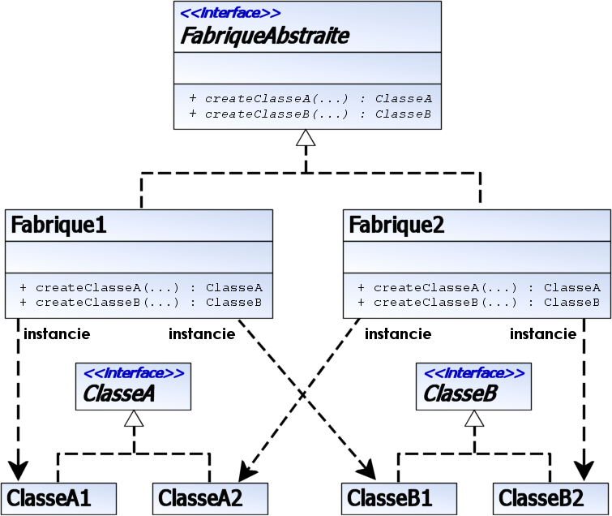

Une fabrique abstraite encapsule un groupe de fabriques ayant une thématique commune. 
Le code client crée une implémentation concrète de la fabrique abstraite, puis utilise les interfaces
 génériques pour créer des objets concrets de la thématique. Le client ne se préoccupe pas de savoir 
 laquelle de ces fabriques a donné un objet concret, car il n'utilise que les interfaces génériques 
 des objets produits. Ce patron de conception sépare les détails d'implémentation d'un ensemble d'objets 
 de leur usage générique.

Un exemple de fabrique abstraite : la classe documentCreator fournit une interface permettant de créer différents 
produits (e.g. createLetter() et createResume()). Le système a, à sa disposition, des versions concrètes dérivées
 de la classe documentCreator, comme par exemple fancyDocumentCreator et modernDocumentCreator, qui possèdent 
 chacune leur propre implémentation de createLetter() et createResume() pouvant créer des objets tels que
  fancyLetter ou modernResume. Chacun de ces produits dérive d'une classe abstraite simple comme Letter ou Resume, 
  connues du client. Le code client obtient une instance de documentCreator qui correspond à sa demande,
   puis appelle ses méthodes de fabrication. Tous les objets sont créés par une implémentation de la classe 
   commune documentCreator et ont donc la même thématique (ici, ils seront tous fancy ou modern). 
   Le client a seulement besoin de savoir manipuler les classes abstraites Letter ou Resume, et non chaque version 
   particulière obtenue de la fabrique concrète.

Une fabrique est un endroit du code où sont construits des objets. Le but de ce patron de conception est d'isoler
 la création des objets de leur utilisation. On peut ainsi ajouter de nouveaux objets dérivés sans modifier le code
  qui utilise l'objet de base.

Avec ce patron de conception, on peut interchanger des classes concrètes sans changer le code qui les utilise, 
même à l'exécution. Toutefois, ce patron de conception exige un travail supplémentaire lors du développement initial, 
et apporte une certaine complexité qui n'est pas forcément souhaitable.
utilisation
La fabrique détermine le type de l'objet concret qu'il faut créer, et c'est ici que l'objet est effectivement créé 
(dans le cas de C++, Java et C#, c'est l'instruction new). Cependant, la fabrique retourne un pointeur abstrait ou
 une référence abstraite sur l'objet concret créé.

Le code client est ainsi isolé de la création de l'objet en l'obligeant à demander à une fabrique de créer l'objet
 du type abstrait désiré et de lui en retourner le pointeur.

Comme la fabrique retourne uniquement un pointeur abstrait, le code client qui sollicite la fabrique ne connaît pas
 et n'a pas besoin de connaître le type concret précis de l'objet qui vient d'être créé. Cela signifie en particulier
  que :

Le code client n'a aucune connaissance du type concret, et ne nécessite donc aucun fichier d'en-tête ou déclaration 
de classe requis par le type concret. Le code client n'interagit qu'avec la classe abstraite. Les objets concrets 
sont en effet créés par la fabrique, et le code client ne les manipule qu'avec leur interface abstraite.
L'ajout de nouveaux types concrets dans le code client se fait en spécifiant l'utilisation d'une fabrique différente, 
modification qui concerne typiquement une seule ligne de code (une nouvelle fabrique crée des objets de types concrets
 différents, mais renvoie un pointeur du même type abstrait, évitant ainsi de modifier le code client). 
 C'est beaucoup plus simple que de modifier chaque création de l'objet dans le code client. Si toutes les 
 fabriques sont stockées de manière globale dans un singleton et que tout le code client utilise ce singleton 
 pour accéder aux fabriques pour la création d'objets, alors modifier les fabriques revient simplement à modifier 
 l'objet singleton.
