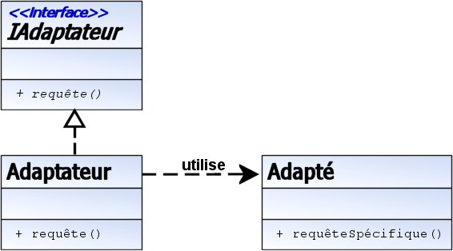
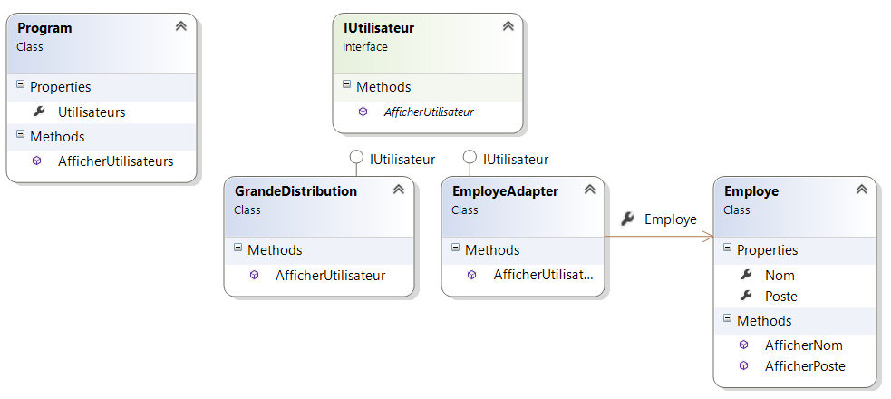

-

Adaptateur 
est un patron de conception qui permet de convertir l'interface d'une classe en une autre 
interface que le client attend. Adaptateur fait fonctionner un ensemble de classes qui n'auraient pas pu 
fonctionner sans lui, à cause d'une incompatibilité d'interfaces.

Exemple
Vous voulez intégrer une classe que vous ne voulez/pouvez pas modifier.

Applicabilité
Une API tiers convient à votre besoin fonctionnel, mais la signature de ses méthodes ne vous convient pas.
Vous voulez normaliser l'utilisation d'anciennes classes sans pour autant en reprendre tout le code.

Le pattern “Adapter” permet de faire rentrer des ronds dans des carrés, de ranger les torchons avec les serviettes et de mélanger
 les choux et les carottes. A peu près. L’objectif est de faire dialoguer un élément hétérogène de notre système avec des éléments
  homogènes. Et ce, sans perturber le fonctionnement du reste de l’application.

Prenons un cas concret. Nous sommes un grossiste et vendons des articles à de grandes enseignes de la grande distribution.
 Nous avons une application mise à disposition de ces clients pour acheter nos articles. Tous nos clients sont homogènes, 
 car ils implémentent l’interface IUtilisateur. Cette application est également ouverte à nos salariés qui souhaitent 
 se fournir directement chez nous, sans passer par la grande distribution.

Un jour, nous avons eu à faire évoluer une fonctionnalité de notre application : lister l’ensemble de nos clients,
 mais cette fois en indiquant pour les employés leur poste actuel.

Notre problème est le suivant : Nous avons une gestion identique des clients et des salariés et nous ne voulons pas 
refaire entièrement la gestion des utilisateurs et souhaitons que cette évolution ne perturbe pas le fonctionnement 
actuel de l’application.

Pour y répondre, nous faisons le choix d’utiliser le pattern “Adapter”, pour que l’appel de la méthode “AfficherUtilisateur”
 nous affiche le nom du client, et dans le cas d’un employé son nom suivi de son poste actuel.

Nous avons créé une application console pour illustrer ce cas. Elle crée une liste de clients et, pour chacun d’eux, appelle 
la méthode “AfficherUtilisateur”. S’il s’agit d’un client, on affiche son nom, s’il s’agit d’un employé, son nom suivi de son poste.
