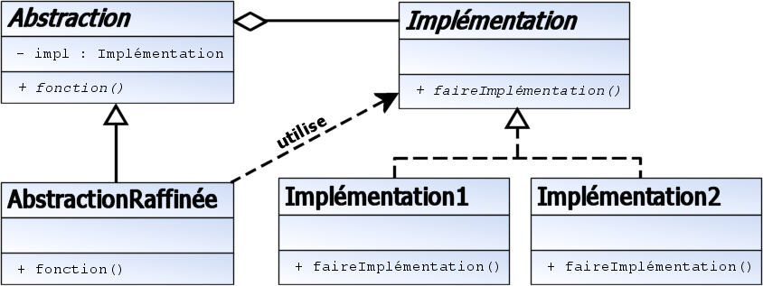

Le pont est un patron de conception qui permet de découpler l'interface d'une classe et son implémentation.
 Ainsi l'interface et l'implémentation peuvent varier séparément.

Attention, à ne pas confondre ce patron avec l'adaptateur. En effet, l'adaptateur est utilisé pour adapter 
l'interface d'une classe vers une autre interface (donc pour faire en sorte que l'interface d'une ou plusieurs 
classes ressemble à l'interface d'une classe en particulier).

Le pont est lui utilisé pour découpler l'interface de l'implémentation. Ainsi, vous pouvez modifier ou changer
 l'implémentation d'une classe sans devoir modifier le code client (si l'interface ne change pas bien entendu).
 
 formes géométriques
Considérons une classe représentant la classe de base de formes géométriques, et ses classes (cercles, rectangles,
 triangles, ...). Tous les types de formes ont des propriétés communes (une couleur par exemple) et des méthodes
  abstraites communes (calcul de surface par exemple) implémentées par les classes dérivées (comment calculer la 
  surface d'un cercle, ...).

Toutes les formes peuvent également se dessiner à l'écran. Mais la façon de dessiner dépend de l'environnement graphique 
et du système d'exploitation. Plutôt que d'ajouter une méthode par environnement possible à chacune des formes, 
le patron de conception Pont suggère de créer une interface séparée pour les primitives de dessin. Cette interface est utilisée 
par les différentes formes qui alors ne dépendent pas de l'implémentation.
