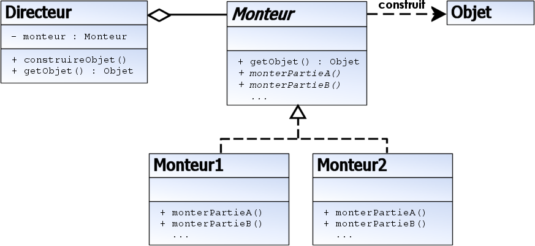

Le monteur (builder) est un patron de conception utilisé pour la création d'une variété d'objets complexes 
à partir d'un objet source. L'objet source peut consister en une variété de parties contribuant 
individuellement à la création de chaque objet complet grâce à un ensemble d'appels à l'interface 
commune de la classe abstraite Monteur.

Un exemple d'objet source est une liste de caractères ou d'images dans un message devant être codé. 
Un objet directeur est nécessaire pour fournir les informations à propos de l'objet source vers la 
classe Monteur. La classe Monteur abstraite pourrait être une liste d'appel de l'interface que la classe
 directeur utilise comme par exemple handleCharacter() ou handleImage(). Chaque version concrète de la 
 classe Monteur pourrait implémenter une méthode pour ces appels ou bien simplement ignorer l'information 
 si appelée. Un exemple de monteur concret serait enigmaBuilder qui chiffrerait le texte, mais ignorerait 
 les images.

Dans l'exemple précédent, le logiciel va créer une classe Monteur spécifique, enigmaBuilder. Cet objet 
est passé à un objet directeur simple qui effectue une itération à travers chaque donnée du message
 principal de l'objet source. La classe monteur crée, incrémentalement, son projet final. Finalement,
  le code principal va demander l'objet final depuis le Monteur et ensuite détruire celui-ci et l'objet 
  directeur. Par la suite, si jamais un remplacement de la technique de cryptage de enigmaBuilder 
  par une autre se faisait sentir, une nouvelle classe Monteur pourrait être substituée avec peu de 
  changements pour la classe directeur et le code principal. En effet, le seul changement serait 
  la classe Monteur actuelle passée en paramètre au directeur.

But : Séparer la construction d'un objet complexe de la représentation afin que le même processus de 
construction puisse créer différentes représentations.
Monteur
interface abstraite pour construire des objets
Monteur1 et Monteur2
fournissent une implémentation de Monteur
construisent et assemblent les différentes parties des objets
Directeur
construit un objet en appelant les différentes méthodes afin de construire chaque partie de l'objet complexe
Objet
l'objet complexe en cours de construction
