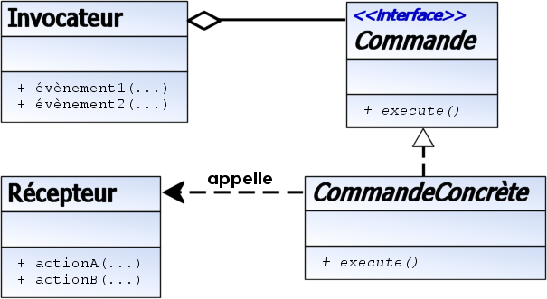

Commande est un patron de conception de type comportemental qui encapsule la notion d'invocation. Il permet de séparer complètement 
le code initiateur de l'action, du code de l'action elle-même. Ce patron de conception est souvent utilisé dans les interfaces 
graphiques où, par exemple, un item de menu peut être connecté à différentes Commandes de façons à ce que l'objet d'item de menu 
n'ait pas besoin de connaître les détails de l'action effectuée par la Commande.

À utiliser lorsque : il y a prolifération de méthodes similaires, et que le code de l'interface devient difficile à maintenir.

Symptômes:

Les objets possèdent trop de méthodes publiques à l'usage d'autres objets.
L'interface est inexploitable et on la modifie tout le temps.
Les noms des méthodes deviennent de longues périphrases.
Un objet Commande sert à communiquer une action à effectuer, ainsi que les arguments requis. L'objet est envoyé à une seule méthode 
dans une classe, qui traite les Commandes du type requis. L'objet est libre d'implémenter le traitement de la Commande par un switch,
ou un appel à d'autres méthodes (notamment des méthodes surchargées dans les sous-classes). Cela permet d'apporter des modifications
aux Commandes définies simplement dans la définition de la Commande, et non dans chaque classe qui utilise la Commande.
Ce patron de conception peut être utilisé pour implémenter divers comportements :

Défaire sur plusieurs niveaux
Les actions de l'utilisateur sont enregistrées par empilement de commandes. Pour les défaire, il suffit de dépiler 
les dernières commandes
 et d'appeler leur méthode undo() pour annuler chaque commande.
Comportement transactionnel
La méthode d'annulation est appelée rollback() et permet de revenir en arrière si quelque chose se passe mal au cours 
d'une transaction (un ensemble de commandes). Exemples : installateurs de programmes, modification de base de données.
Barre de progression
Si chaque Commande possède une méthode d'estimation de durée, il est possible de représenter la progression de 
l'exécution d'un ensemble de tâches (Commandes).
Menu et boutons (interface graphique)
En Swing et Delphi, un objet Action est une Commande à laquelle on peut associer un raccourci clavier, une icône, 
un texte d'info-bulle ...
Wizards
Pour implémenter les boîtes de dialogue de type Wizard, une instance de Commande est créée. Chaque fois que 
l'utilisateur passe à la page suivante avec le bouton "Suivant" ("Next" en anglais), les valeurs entrées sont
 enregistrées dans la Commande. Le bouton "Terminer" ("Finish" en anglais) provoque l'exécution de la Commande.
Ensemble de threads (ThreadPool en anglais)
Un ensemble de threads exécute des tâches (Commandes) stockées dans une file.
Enregistrement de macros
Chaque action de l'utilisateur peut être enregistrée sous la forme d'une séquence de Commande qui peut être
 rejouée par la suite. Pour enregistrer les macros sous la forme de scripts, chaque commande possède une méthode
  toScript() pour générer le script correspondant.
