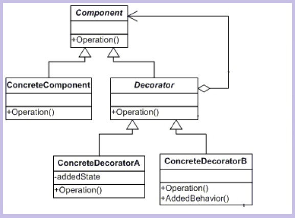

Un décorateur est le nom d'un patron de conception de structure.

Un décorateur permet d'attacher dynamiquement de nouveaux comportements ou responsabilités à un objet. 
Les décorateurs offrent une alternative assez souple à l'héritage pour composer de nouvelles fonctionnalités.
Beaucoup de langages de programmation orientés objets ne permettent pas de créer dynamiquement des classes, 
et la conception ne permet pas de prévoir quelles combinaisons de fonctionnalités sont utilisées pour créer autant de classes.

Exemple : Supposons qu'une classe de fenêtre Window ne gère pas les barres de défilement. On créé une sous-classe ScrollingWindow.
 Maintenant, il faut également ajouter une bordure. Le nombre de classes croît rapidement si on utilise l'héritage : 
 on créé les classes WindowWithBorder et ScrollingWindowWithBorder.

Par contre, les classes décoratrices sont allouées dynamiquement à l'utilisation, permettant toutes sortes de combinaisons. 
Par exemple, les classes d'entrées-sorties de Java permettent différentes combinaisons (FileInputStream + ZipInputStream, ...).

En reprenant l'exemple des fenêtres, on créé les classes ScrollingWindowDecorator et BorderedWindowDecorator sous-classes 
de Window stockant une référence à la fenêtre à « décorer ». Étant donné que ces classes décoratives dérivent de Window,
 une instance de ScrollingWindowDecorator peut agir sur une instance de Window ou une instance de BorderedWindowDecorator.
