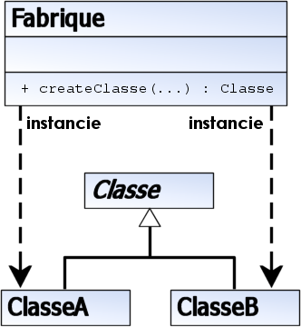

# La fabrique (factory) 
est un patron de conception de création utilisé en programmation orientée objet. 
Comme les autres modèles de création, la fabrique a pour rôle l'instanciation d'objets divers dont le
 type n'est pas prédéfini : les objets sont créés dynamiquement en fonction des paramètres passés à la 
 fabrique.

Comme en général, les fabriques sont uniques dans un programme, on utilise souvent le patron de conception 
singleton pour gérer leur création.

# Base de données
Considérons une interface de base de données qui supporte de nombreux types de champs. Les champs d'une table 
sont représentés par une classe abstraite appelée Champ. Chaque type de champ est associé à une sous-classe de Champ, 
donnant par exemple : ChampTexte, ChampNumerique, ChampDate, ou ChampBooleen.

La classe Champ possède une méthode display() permettant d'afficher le contenu d'un champ dans une interface utilisateur.
Un objet de contrôle est créé pour chaque champ, la nature de chaque contrôle dépendant du type du champ associé :
le contenu de ChampTexte sera affiché dans un champ de saisie texte, celui de ChampBooleen sera représenté par une 
case à cocher.

Pour résoudre ce problème, Champ contient une méthode de fabrique appelée createControl() et appelée depuis display() 
pour créer l'objet adéquat.

Animaux
Dans l'exemple suivant, en Java, une classe « fabrique » des objets dérivés de la classe Animal en fonction du nom 
de l'animal passé en paramètre. Il est également possible d'utiliser une interface comme type de retour de la fonction.
