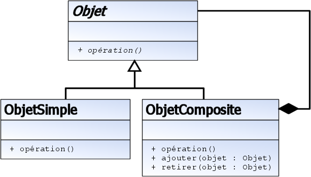

Dans ce patron de conception, un objet composite est constitué d'un ou de plusieurs objets similaires 
(ayant des fonctionnalités similaires). L'idée est de manipuler un groupe d'objets de la même façon que s'il s'agissait 
d'un seul objet. Les objets ainsi regroupés doivent posséder des opérations communes, c'est-à-dire un "dénominateur commun".

Quand l'utiliser
Vous avez l'impression d'utiliser de multiples objets de la même façon, souvent avec des lignes de code identiques ou presque. 
Par exemple, lorsque la seule et unique différence entre deux méthodes est que l'une manipule un objet de type Carré, et l'autre
 un objet Cercle. Lorsque, pour le traitement considéré, la différenciation n'a pas besoin d'exister, il serait plus simple 
 de considérer l'ensemble de ces objets comme homogène.

Un exemple
Un exemple simple consiste à considérer l'affichage des noms de fichiers contenus dans des dossiers :

Pour un fichier, on affiche ses informations.
Pour un dossier, on affiche les informations des fichiers qu'il contient.
Dans ce cas, le patron composite est tout à fait adapté :

L'Objet est de façon générale ce qui peut être contenu dans un dossier : un fichier ou un dossier,
L'ObjetSimple est un fichier, sa méthode affiche() affiche simplement le nom du fichier,
L'ObjetComposite est un dossier, il contient des objets (c'est à dire des fichiers et des dossiers). Sa méthode affiche() 
parcourt l'ensemble des objets qu'il contient (fichier ou dossier) en appelant leur méthode affiche().

Objet
déclare l'interface pour la composition d'objets
met en œuvre le comportement par défaut
ObjetSimple
représente les objets manipulés, ayant une interface commune
ObjetComposite
définit un comportement pour les composants ayant des enfants
stocke les composants enfants
met en œuvre la gestion des composants enfants
La classe utilisatrice manipule les objets de la composition à travers l'interface Objet.
