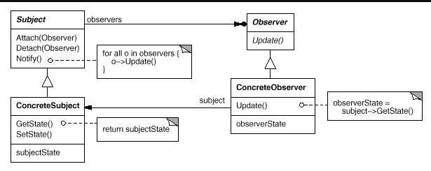

Le patron de conception observateur/observable est utilisé en programmation pour envoyer un signal à des
 modules qui jouent le rôle d'observateur. En cas de notification, les observateurs effectuent alors 
 l'action adéquate en fonction des informations qui parviennent depuis les modules qu'ils observent (les "observables").
