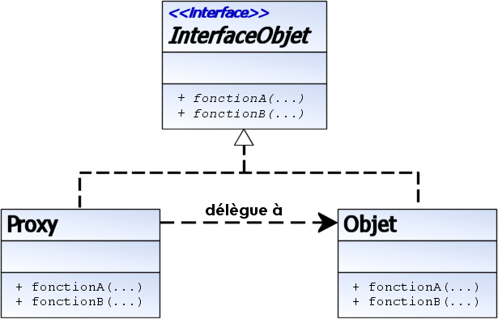

Un proxy est une classe se substituant à une autre classe. Par convention et simplicité, le proxy implémente la même interface
 que la classe à laquelle il se substitue. L'utilisation de ce proxy ajoute une indirection à l'utilisation de la classe à substituer.
  Le proxy sert à gérer l'accès à un objet, il agit comme un intermédiaire entre la classe utilisatrice et l'objet.

Un proxy est un cas particulier du patron de comportement État. Un proxy implémente une et une seule interface, donc se substitue 
à une seule classe. Un état peut implémenter un nombre quelconque d'interfaces.

Un proxy est utilisé principalement pour contrôler l'accès aux méthodes de la classe substituée. Un état est utilisé pour changer 
dynamiquement d'interface.

Outre l'utilisation principale du proxy (contrôle des accès), ce dernier est également utilisé pour simplifier l'utilisation 
d'un objet « complexe » à la base. Par exemple, si l'objet doit être manipulé à distance (via un réseau) ou si l'objet est consommateur
 de temps.

Il existe différents types de Proxy ayant un comportement ou un rôle différent :

Remote proxy : fournir une référence sur un objet situé sur un espace d'adressage différent, sur la même machine ou sur une autre,
Virtual proxy : retarder l'allocation mémoire des ressources de l'objet jusqu'à son utilisation réelle,
Copy-on-write proxy : une forme de proxy virtuel pour retarder la copie de l'objet jusqu'à demande par la classe utilisatrice,
 utilisé notamment pour la modification concurrente par différents threads,
Protection (access) proxy : fournir à chaque classe cliente un accès à l'objet avec des niveaux de protection différents,
Firewall proxy : protéger l'accès à l'objet par des classes « malveillantes » ou vice-versa,
Synchronization proxy : fournir plusieurs accès à l'objet synchronisé entre différentes classes utilisatrices (cas de threads multiples),
Smart reference proxy : fournir des actions supplémentaires à chaque accès à l'objet (compteur de références, ...),
Cache proxy : stocker le résultat d'opérations coûteuse en temps, afin de pouvoir les partager avec les différentes classes 
utilisatrices.
