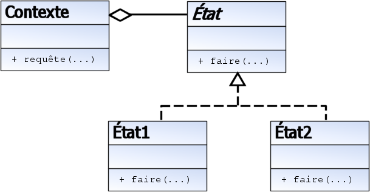

La technique de l'État est un patron de conception comportemental utilisé
 en génie logiciel. Ce patron de conception est utilisé entre autres lorsqu'il est souhaité 
 pouvoir changer le comportement de l'État d'un objet sans pour autant en changer l'instance.
La classe censée changer d'état a un lien vers une classe abstraite "État". Cette classe abstraite "État" définit
 les différentes méthodes qui seront à redéfinir dans les implémentations. Dans chaque classe dérivée d'État, 
 l'appel à la méthode X pourra avoir un comportement différent.

La classe pouvant changer d'état appellera les services de sa classe d'état dont l'instance change quand 
le comportement de notre classe change. De plus l'instance de la classe pouvant changer d'état peut être passée 
en paramètre à la méthode X de sa classe d'état. Ceci permet de changer l'état de la classe pendant l'exécution 
de la méthode X en instanciant un nouvel état.

Ce patron permet donc à la classe de passer d'un état à l'autre de telle façon que cette dernière apparaît
 changer de type dynamiquement (sans changer d'instance).

Exemple : Un programme de dessin utilise une interface abstraite pour représenter un outil. Chaque instance de
 ses classes dérivées concrètes représente un type d'outil différent. Quand l'utilisateur change d'outil, 
 une nouvelle instance de la classe dérivée associée est créée.
