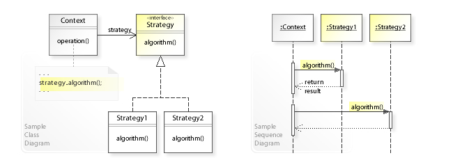

Le patron stratégie est un patron de conception de type comportemental
 grâce auquel des algorithmes peuvent être sélectionnés à la volée au cours de l'exécution selon certaines
  conditions, comme les stratégies utilisées en temps de guerre.

Le patron de conception stratégie est utile pour des situations où il est nécessaire de permuter 
dynamiquement les algorithmes utilisés dans une application. Le patron stratégie est prévu pour fournir 
des moyens de définir une famille d'algorithmes, encapsuler chacun comme objet, et les rendre interchangeables.
 Le patron stratégie laisse les algorithmes changer indépendamment des clients qui les emploient.
